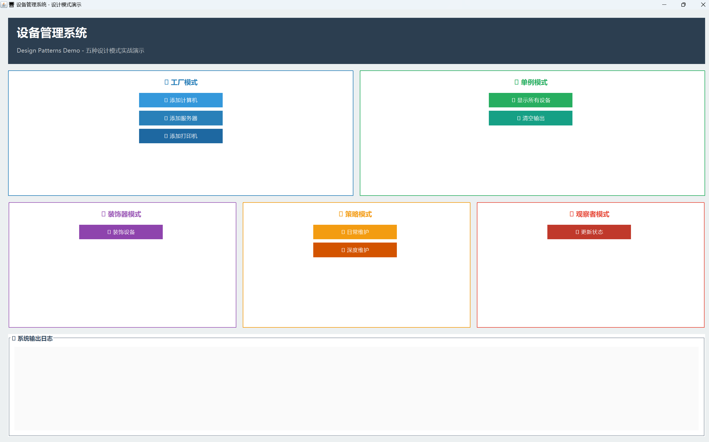
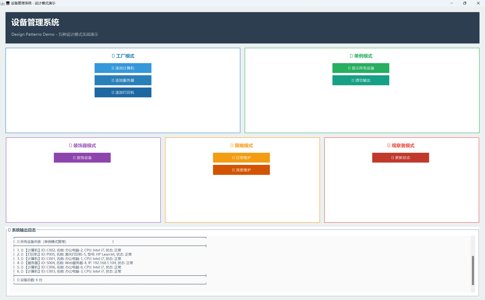
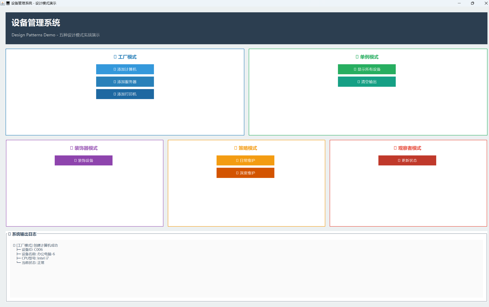
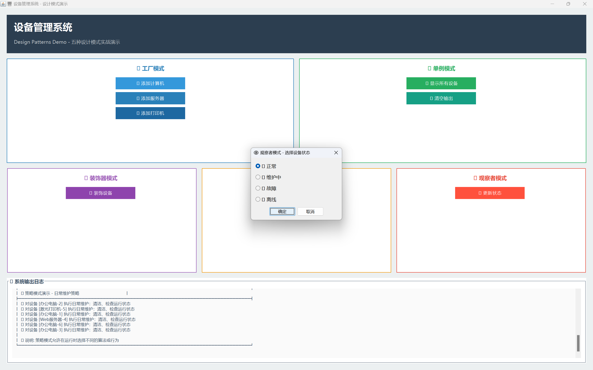
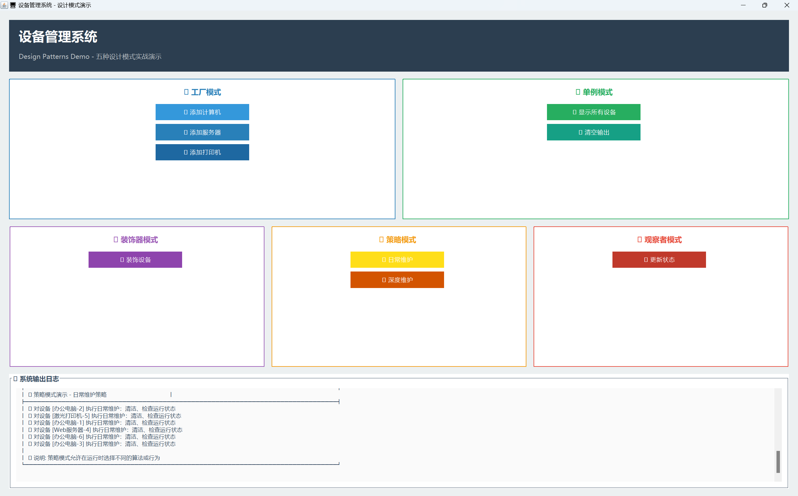
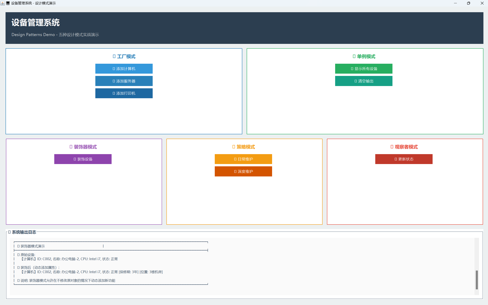

# 设备管理系统 - 设计模式演示

一个Java桌面应用程序，展示五种经典设计模式的实际应用。

## 📦 快速开始

### 克隆项目到本地

```bash
git clone https://github.com/story-1949/shixun.git
cd shixun
```

## 🎯 项目特点

- **简洁清晰**：代码结构清晰，易于理解
- **设计模式**：完整展示5种设计模式的实际应用
- **可视化界面**：基于Swing的现代化GUI界面
- **实用功能**：设备管理的核心功能

## 📐 设计模式应用

### 1. 工厂模式 (Factory Pattern)
- **位置**: `com.device.factory`
- **应用**: 创建不同类型的设备（计算机、服务器、打印机）
- **优势**: 解耦对象创建逻辑，易于扩展新设备类型

### 2. 单例模式 (Singleton Pattern)
- **位置**: `com.device.singleton.DeviceManager`
- **应用**: 全局设备管理器，确保只有一个实例
- **实现**: 双重检查锁（线程安全）

### 3. 装饰器模式 (Decorator Pattern)
- **位置**: `com.device.decorator`
- **应用**: 动态为设备添加属性（位置、保修期等）
- **优势**: 不修改原类的情况下扩展功能

### 4. 策略模式 (Strategy Pattern)
- **位置**: `com.device.strategy`
- **应用**: 不同的设备维护策略（日常维护、深度维护）
- **优势**: 算法可以自由切换，易于扩展

### 5. 观察者模式 (Observer Pattern)
- **位置**: `com.device.observer`
- **应用**: 设备状态变化时通知多个观察者（日志、告警）
- **优势**: 实现松耦合的事件通知机制

## 🚀 运行方式

### 编译
```bash
javac -encoding UTF-8 -d bin -sourcepath src src/com/device/Main.java
```

### 运行GUI界面
```bash
java -cp bin com.device.Main
```

### 运行控制台演示
```bash
javac -encoding UTF-8 -cp bin -d bin TestDemo.java
java -cp bin TestDemo
```

## 📁 项目结构

```
device-management-system/
├── src/com/device/
│   ├── Main.java                    # 主程序入口
│   ├── model/                       # 设备模型
│   │   ├── Device.java             # 设备基类
│   │   ├── Computer.java           # 计算机
│   │   ├── Server.java             # 服务器
│   │   └── Printer.java            # 打印机
│   ├── factory/                     # 工厂模式
│   │   ├── DeviceFactory.java      # 工厂接口
│   │   ├── ComputerFactory.java
│   │   ├── ServerFactory.java
│   │   └── PrinterFactory.java
│   ├── singleton/                   # 单例模式
│   │   └── DeviceManager.java      # 设备管理器
│   ├── decorator/                   # 装饰器模式
│   │   ├── DeviceDecorator.java    # 装饰器基类
│   │   ├── LocationDecorator.java  # 位置装饰器
│   │   └── WarrantyDecorator.java  # 保修装饰器
│   ├── strategy/                    # 策略模式
│   │   ├── MaintenanceStrategy.java
│   │   ├── MaintenanceContext.java
│   │   ├── DailyMaintenanceStrategy.java
│   │   └── DeepMaintenanceStrategy.java
│   ├── observer/                    # 观察者模式
│   │   ├── DeviceObserver.java     # 观察者接口
│   │   ├── LogObserver.java        # 日志观察者
│   │   └── AlertObserver.java      # 告警观察者
│   └── ui/                          # 用户界面
│       └── DeviceManagementUI.java
├── TestDemo.java                    # 控制台演示程序
└── README.md
```

## 💡 使用说明

### GUI界面操作

1. **添加设备**: 点击"添加计算机/打印机/服务器"按钮，使用工厂模式创建设备
2. **查看设备**: 点击"显示所有设备"查看单例管理器中的所有设备
3. **装饰设备**: 点击"装饰设备"为设备动态添加属性
4. **维护操作**: 选择不同的维护策略对设备进行维护
5. **状态更新**: 更新设备状态，观察者会自动收到通知

### 界面特色

- 🎨 现代化配色方案
- 📊 清晰的卡片式布局
- 🖱️ 鼠标悬停效果
- 📝 详细的设备信息展示
- 💬 友好的用户提示

## 🎓 学习要点

- 理解每种设计模式的应用场景
- 观察设计模式如何提高代码的可维护性和扩展性
- 学习如何在实际项目中组合使用多种设计模式

## 📝 扩展建议

- 添加更多设备类型（路由器、交换机等）
- 实现更多装饰器（价格、供应商等）
- 增加更多维护策略
- 添加数据持久化功能
- 实现设备搜索和过滤功能

## 📸 效果展示

### 主界面


系统主界面采用现代化设计，包含：
- 🎨 深色顶部导航栏，清晰的标题和副标题
- 🏭 工厂模式区域（蓝色）- 创建不同类型的设备
- 🔒 单例模式区域（绿色）- 管理所有设备
- 🎨 装饰器模式区域（紫色）- 动态添加设备属性
- ⚙️ 策略模式区域（橙色）- 选择维护策略
- 👁️ 观察者模式区域（红色）- 监控设备状态

### 工厂模式演示


点击按钮创建设备，系统会详细显示：
- 设备ID、名称、规格参数
- 创建成功的提示信息
- 树形结构展示设备属性

### 设备列表展示


单例模式管理的设备列表：
- 📊 表格化展示所有设备
- 💻🖥️🖨️ 不同图标区分设备类型
- 统计设备总数

### 装饰器模式演示


动态为设备添加属性：
- 原始设备信息对比
- 装饰后的完整信息（保修期、位置等）
- 设计模式说明

### 策略模式演示


不同的维护策略：
- 🔧 日常维护策略
- 🛠️ 深度维护策略
- 批量处理所有设备

### 观察者模式演示


状态更新通知机制：
- 友好的单选按钮界面
- 状态变更前后对比
- 观察者通知结果展示

### 控制台演示


命令行版本演示：
- 完整的五种设计模式演示
- 清晰的日志输出
- 适合学习和调试

---

> **提示**: 如果图片无法显示，请确保已将截图放置在 `images/` 目录下，或直接运行程序查看实际效果。

## 👨‍💻 技术栈

- Java SE
- Swing GUI
- 设计模式（工厂、单例、装饰器、策略、观察者）

## 📄 许可证

本项目仅用于学习和演示目的。
